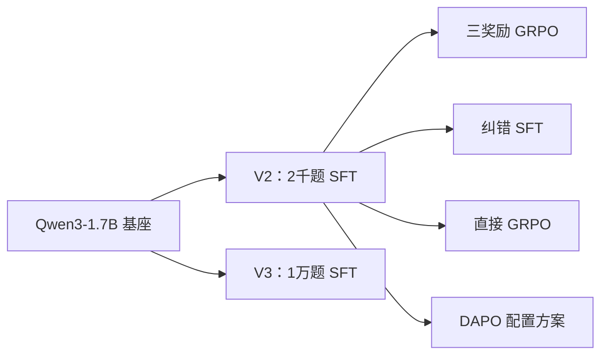
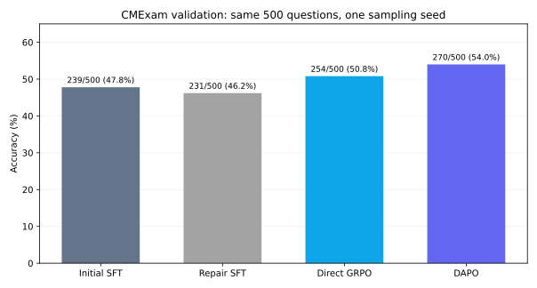

# 中文医考小模型后训练：从格式学会到答题改进

这是我第一次独立推进的后训练项目。问题很直接：**SFT 已能让 1.7B 模型按格式作答，GRPO 能否让它真正多答对医学选择题？** 我先试三奖励 GRPO，再扩大 SFT 数据，最后比较纠错 SFT、直接 GRPO 和 DAPO 配置方案；失败的路线也保留。

## 路线

实际尝试顺序是 **V2 → V3 → 最终对照**。图中的箭头是权重继承：V3 没有接到最终 GRPO/DAPO；纠错 SFT 也没有成为它们的起点。更早的 Qwen2.5-1.5B 实验用于摸索流程，见[历史实验](03-explorations-and-ablations.md)。

## 同协议结果

四阶段使用同一 500 道 val 题、同一 BF16 非量化采样评估；逐题 JSONL 已复算。完整指标、改对/改错题数和耗时见[主结果](02-main-results.md)。

| 从 V2 初始 SFT 出发 | 答对 / 500 | 相对起点 |
| --- | ---: | ---: |
| 初始 SFT | 239（47.8%） | — |
| 纠错 SFT | 231（46.2%） | −8 题 |
| 直接 GRPO | 254（50.8%） | +15 题 |
| DAPO 配置方案 | 270（54.0%） | +31 题 |

纠错 SFT 让训练池中“同题四答有对有错”的组变多，却让验证集净少 8 题。直接 GRPO 和 DAPO 都有提升，但 **DAPO 高 3.2 个百分点是完整方案差距**：框架、损失和重采样同时变化，不能归因于某一技巧。结果仅来自一次训练和反复用于决策的验证集，不等于稳定的 test 表现。

[实验设计](01-experiment-design.md) · [主结果](02-main-results.md) · [历史探索](03-explorations-and-ablations.md) · [代码与复核](04-reproduction-and-code.md) · 待补清单（仅存于本地）
