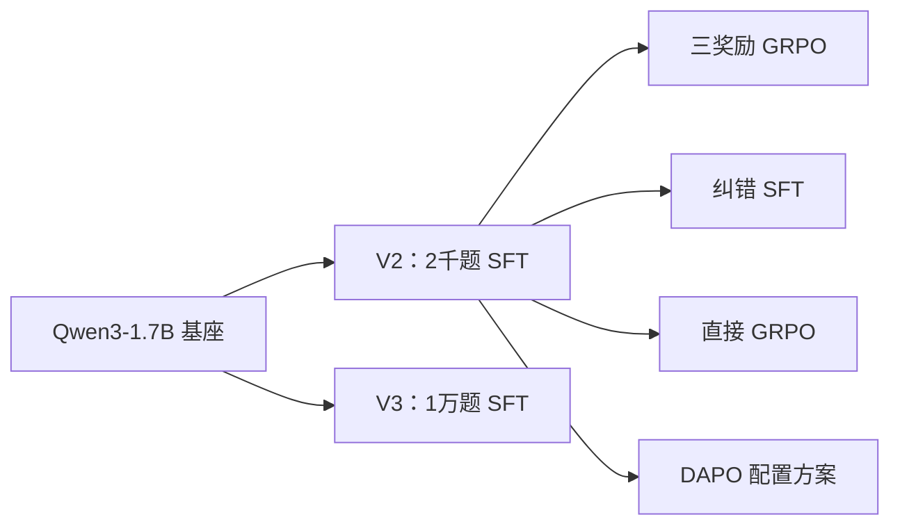
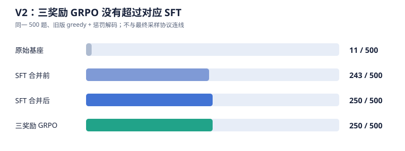

# 中文医考小模型后训练：从格式学会到答题改进

这是我第一次独立推进的后训练项目。问题很直接：**SFT 已能让 1.7B 模型按格式作答，GRPO 能否让它真正多答对医学选择题？** 我先试三奖励 GRPO，再扩大 SFT 数据，最后比较纠错 SFT、直接 GRPO 和 DAPO 配置方案；失败的路线也保留。

## 路线

实际尝试顺序是 **V2 → V3 → 最终对照**。图中的箭头是权重继承：V3 没有接到最终 GRPO/DAPO；纠错 SFT 也没有成为它们的起点。更早的 Qwen2.5-1.5B 实验用于摸索流程，见[历史实验](#历史探索)。

## 主要结果

四份逐题 JSONL 的题号与标准答案顺序一致，均按[统一评估协议](#实验设计)生成。以下数字由复算脚本（仅存于本地）重算，原始映射见证据索引（仅存于本地）。

| 模型 | 答对 / 500 | 格式合格 | 可解析 | 截断 |
| --- | ---: | ---: | ---: | ---: |
| 初始 SFT | 239（47.8%） | 481（96.2%） | 481（96.2%） | 18（3.6%） |
| 纠错 SFT | 231（46.2%） | 483（96.6%） | 483（96.6%） | 16（3.2%） |
| 直接 GRPO | 254（50.8%） | 489（97.8%） | 489（97.8%） | 10（2.0%） |
| DAPO 配置方案 | 270（54.0%） | 485（97.0%） | 485（97.0%） | 15（3.0%） |

**格式已基本学会，答题仍是瓶颈。** 以 DAPO 为例，15 道格式不合格题即使全部改对，正确率至多再增加 3 个百分点；其余错误不能靠修格式解决。这里的“正确”仅指抽取选项等于题库字母。

### 同题配对：改对了多少，也改错了多少

| 相对初始 SFT，除最后一行 | 错 → 对 | 对 → 错 | 净变化 | 正确率变化 |
| --- | ---: | ---: | ---: | ---: |
| 纠错 SFT | 31 | 39 | −8 题 | −1.6 个百分点 |
| 直接 GRPO | 35 | 20 | +15 题 | +3.0 个百分点 |
| DAPO 配置方案 | 55 | 24 | +31 题 | +6.2 个百分点 |
| DAPO 相对直接 GRPO | 39 | 23 | +16 题 | +3.2 个百分点 |

| 题号 | 标准答案 | 初始 SFT | 直接 GRPO | DAPO | 现象 |
| --- | :---: | :---: | :---: | :---: | --- |
| `val-3813` | A | E | A | A | 两条 RL 都改对 |
| `val-5904` | B | B | B | D | DAPO 从对变错 |
| `val-782` | C | A | D | E | 三阶段均错 |
| `val-5306` | C | D | D | 未解析 | DAPO 截断 |

只列题号和字母；这些个例不能证明某题变动的原因。

### 时间与结论边界

| 训练 | 保存的耗时 | 对应验证正确率 |
| --- | ---: | ---: |
| 纠错 SFT | 1,158 秒（约 19 分） | 46.2% |
| 直接 GRPO | 10,868 秒（约 3 小时） | 50.8% |
| DAPO 配置方案 | 22,744 秒（约 6 小时 19 分） | 54.0% |

记录的 GPU 为 RTX 4090。DAPO 换了框架并动态重采，实际生成量和实现开销不同；不能把时长比解释成算法固有速度比。两条 RL 的 **3.2 个百分点**也不是某个 DAPO 组件的消融结论。

这是**单次训练、单个评估种子**在反复用于方案选择的 val 上的结果。保留的 test 尚未统一终评；“54.0%”不代表稳定泛化或临床可用。下一轮应先锁定方案，再评 test、重复采样与训练种子，并抽样审查答案和参考解析。详细缺口在待补清单（仅存于本地）；完整数字在[结果 CSV](data/results-summary.csv)。

## 实验设计

### 数据与边界

任务是 CMExam 中文单选题：输入题干和 A～E 选项，目标是输出解析和唯一答案。原始文件为 train、val、test_with_annotations；来源与哈希见原始清单（原始文件仅存于本地）。**500 道 val** 用于比较和方案选择；另保留 **500 道 test**，本次没有用作统一终评。

数据处理先校验题干、选项与答案，按去空白后的题干哈希去重，并从 train 排除 val/test 的同键题。Qwen3 训练另要求非空解析、无保留标签字符、提示词和目标长度不过限。做到的是**精确题干去重**；没有审计语义近重复、医学答案正确性或解析质量。

| 阶段 | 冻结训练题数 | 来源与取样重点 |
| --- | ---: | --- |
| V2 初始 SFT | 2,000 | 有解析题；包含约 200 道正则识别的反向选择题 |
| V2 三奖励 GRPO | 1,000 | 与 SFT 分开的候选池 |
| V3 扩量 SFT | 10,000 | 有解析、长度合格；含约 1,000 道反向选择题 |
| 最终直接 GRPO / DAPO | 共用 2,500 | 从同一冻结训练池出发 |
| 纠错 SFT | 606 | 初始模型四答全错且满足长度条件的题 |

“反向选择题”只是正则覆盖控制，不等于经过人工确认的难度或科室分层。候选池和划分实现（原始文件仅存于本地）在 B1/B1c；版本间的样本和协议差异见[实验索引](data/experiment-index.csv)。

### 训练怎么分支

V2 用 Qwen3-1.7B、BF16 LoRA（rank 32、alpha 64）训练 2 epochs，目标为 `<think>参考解析</think><answer>字母</answer>`。其合并权重是最终三条分支的共同起点：

- **纠错 SFT**：把四答全错题的标准答案和参考解析再次监督训练；这条探索到此停止。
- **直接 GRPO**：每题生成 `G=4` 答，仅按最终字母是否正确给 0/1 奖励；全对或全错组在生成后屏蔽梯度，仍耗费生成计算。
- **DAPO 配置方案**：同一起点、同一 2,500 题池与 0/1 奖励，在 ms-swift 的 GRPO 入口启用 `loss_type=dapo`、不对称 clip、动态重采（最多 3 次）、token 级损失和过长过滤。它不是论文机制的逐项复现。

V3 的 10,000 题 SFT 独立从原始基座启动，**不向最终两条 RL 分支提供权重**。旧 V2 三奖励 GRPO 则在正确性以外增加格式奖励和答对后才给的解析奖励；具体数值留在[历史页](#历史探索)。

### 同一分数的定义

最终四阶段都在同一 500 道 val 题上，以 BF16 非量化模型、Qwen3 thinking 模板、`temperature=0.6`、`top_p=0.95`、`seed=42`、最多 1,536 个新 token 评估；没有重复或频率惩罚。训练中每约 10% 的固定 10 题监控只用于观察，不能替代 500 题结果。

`extract_answer` 从最终回答抽取唯一字母；`correct` 是该字母等于题库答案，不是解析的医学质量。`format_ok` 要求闭合且非空的 `<think>` 段和唯一 `<answer>` 标签；`parse_ok` 只要求可靠抽取答案；`truncated` 表示生成未正常 stop。格式失败与截断可重叠。解析函数（原始文件仅存于本地）在 A2。

V2/V3 旧结果使用 greedy 且带重复、频率惩罚；更早 Qwen2.5 还混有量化与 FP32 复评。**不同协议的正确率不连成一条训练曲线**。各结果的 `protocol_id` 见[数值表](data/results-summary.csv)。

## 历史探索

更早的 Qwen2.5-1.5B 先用于跑通流程：32 题 smoke 的基座、SFT、GRPO 都答对 17 题。正式 SFT 的旧协议合并前、后为 302/500、274/500，FP32 复评为 331/500；G=2/G=8 的 FP32 复评分别为 332/500、334/500。加载精度、评估协议和生成预算没有固定，不能把这些差异当作纯粹的合并或 G 值消融。

### V2：先检验三奖励

medical_grpo2.ipynb（原始文件仅存于本地）从 3,000 道 SFT 候选与 1,500 道 GRPO 候选中冻结 **2,000 / 1,000 题**。Qwen3-1.7B 的 BF16 LoRA 使用 rank 32、alpha 64；SFT 两轮 **500 步**，保存耗时 **405.5 秒**。GRPO 为 `G=4`、一轮 **500 步**，奖励是**格式 0.2 + 正确性 1.0 + 答对后解析 0.3**，解析由远程裁判参照标准答案与参考解析评分。末次续训调用记录 **3,691 秒**；曾从 checkpoint-100 恢复，完整总耗时未记录。

下图只画**同一旧版 greedy 协议**下的 500 道验证题；该协议带重复和频率惩罚，不与最终采样协议画在一条曲线上。

| 阶段 | 答对 / 500 | 格式合格 | 可解析 |
| --- | ---: | ---: | ---: |
| 基座 | 11 | 0 | 13 |
| SFT 合并前 | 243 | 499 | 499 |
| SFT 合并后 | 250 | 499 | 499 |
| 三奖励 GRPO | 250 | 498 | 498 |

基座的 **11/500 是严格输出解析规则下的分数**，不能理解成医学知识只有 2.2%。SFT 合并前后差 7 题，未做只改变“合并”的受控实验。三奖励 GRPO 没有净增，但也不能单凭它认定解析奖励无效。

当时对 **1,500 道候选题**每题采样四答：全错 **366**、有对有错 **769**、全对 **365**。它是候选池诊断，**不是** 1,000 道冻结训练题的梯度统计；提示了全错组缺正确信号的问题，不能解释全部验证结果。[逐题复算值](data/results-summary.csv)与证据索引（仅存于本地）保留核对路径。

### V3：扩大 SFT 数据，没有接续到最终 RL

medical_grpo3.ipynb（原始文件仅存于本地）从 15,000 道候选题中找到 **12,792 道有解析**；再按解析、标签和长度筛选至 **12,459 道合格**，取 **10,000 道**训练，其中约 1,000 道为正则识别的反向题。主要剔除项为缺解析 2,208、目标过长 278、保留标签字符 55；这不是医学正确性审核。

两轮共 **2,500 步**，两次训练调用分别约 **941 秒**和 **1,015 秒**，训练 loss 从 **1.3905** 降到 **0.6016**。第 1 轮逐题验证 **236/500（47.2%）**。第 2 轮的 **50.8%** 只留在当时对话和后补文字，保存的 D4 输出是 vLLM 启动错误，也未找到对应逐题 JSONL，故**未独立复算、未入结果 CSV**。冻结的 1,000 题 GRPO 池没有完成训练或评估的证据。

V3 与 V2 不只差训练题数，还差训练步数和权重状态；即便将来证实第 2 轮分数，也不足以断言“数据饱和”。

### 这次修正的判断

- **G=8 必然更好吗？** 旧 Qwen2.5 FP32 复评只比 G=2 多 2/500，但训练记录约 57,139 秒对 9,730 秒。生成预算也不同，不能当纯 G 消融。
- **纠错让混合组变多就会答对更多吗？** 最终池的混合组从 1,285 增到 1,454/2,500，验证却净少 8 题。可学习组数量与最终准确率不是同一指标。
- **屏蔽全错组就教会标准答案了吗？** 没有。直接 GRPO 仍先生成四答，全错组被屏蔽梯度后没有答案监督；DAPO 动态重采寻找有差异的组，也不能凭空提供知识。

## 代码与复核

**复算已完成；训练没有为写笔记而重跑。** 本地归档缺合并基座、LoRA 权重和完整优化器 checkpoint，不能只凭 notebook 与指标文件复现同一训练。主文件是medical_grpo2 (1).ipynb（原始文件仅存于本地）；当前代码可能经过修改，不能自动当成产生旧输出时的配置。

### 可复核什么

本地复算脚本和逐题 JSONL 没有公开，因此这份仓库**只能核查汇总值和协议说明，不能独立重跑逐题复算**。本地复算已执行成功：脚本检查题号唯一和主实验四份 `(id, gold)` 顺序一致，汇总 20 行历史与主实验记录；不加载模型、不用 GPU。两张图只取同协议的真实结果，不插值训练曲线：[主实验](assets/validation-accuracy.svg)、[V2 旧协议](assets/v2-greedy-accuracy.svg)。详细证据映射保留在本地。

### 如果将来重新运行

| 阶段 | 主 notebook 单元 / 函数 | 性质 |
| --- | --- | --- |
| 环境、配置、解析与评估定义 | A0～A3c；`extract_answer`、`evaluate_vllm` | 定义为主；A1 建目录 |
| 清洗与冻结题池 | B0～B2；`question_key`、`build_candidates` | B1c 写数据；不训练 |
| 初始 SFT 评估 | C0～C1 | GPU 推理；已有 JSONL 可直接复核 |
| 四答诊断 | D0～D2 | GPU 推理；不更新权重 |
| 纠错探索 | E0～E4 | **E1 训练**；与后续 RL 分支分开 |
| 直接 GRPO | F0～F3；`MixedOnlyGRPOTrainer` | **F2 训练**；从初始 SFT 启动 |
| GRPO 评估 | G0～G3 | 推理占 GPU；读既有汇总不训练 |
| DAPO 方案 | H0～H6；`build_dapo_command` | **H3 开启训练开关后会训练**；归档默认关闭 |

原始实现请读对应单元。本文不复制长代码；训练奖励插件（原始文件仅存于本地）和实际 DAPO 参数（原始文件仅存于本地）可用于核对配置，不代表已完成论文逐项复现。

### 环境与文件索引

Qwen3 主路线保存的环境为 RTX 4090、`torch 2.8.0+cu128`、`transformers 4.55.2`、`trl 0.21.0`、`peft 0.17.1`、`vllm 0.10.2`；DAPO 使用独立的 `ms-swift 4.5.3`、`trl 0.26.2`、`transformers 4.56.1`。具体以主协议（原始文件仅存于本地）和归档参数（原始文件仅存于本地）为准。Qwen2.5 的环境另见早期记录（原始文件仅存于本地），不要混装依赖。

| 文件 | 用途 |
| --- | --- |
| medical_grpo.ipynb（原始文件仅存于本地） | Qwen2.5 smoke、G=2/G=8、FP32 复评 |
| medical_grpo2.ipynb（原始文件仅存于本地） | Qwen3 V2：2千题 SFT 与三奖励 GRPO |
| medical_grpo3.ipynb（原始文件仅存于本地） | Qwen3 V3：1万题 SFT；第二轮逐题评估缺失 |
| medical_grpo2 (1).ipynb（原始文件仅存于本地） | 最终纠错探索、直接 GRPO、DAPO 配置对照 |
| 最终云端输出归档（原始文件仅存于本地） · 运行摘要（原始文件仅存于本地） | 输出、评估配置与耗时；不含权重 |
| [实验索引](data/experiment-index.csv) · [结果表](data/results-summary.csv) · 证据索引（仅存于本地） | 配置、协议、数字与原文件位置 |

公开笔记不附题目原文、模型权重或私有证据归档。无法复训的条件及未完成的 test、多种子和 V3 第二轮核验见待补清单（仅存于本地）。
