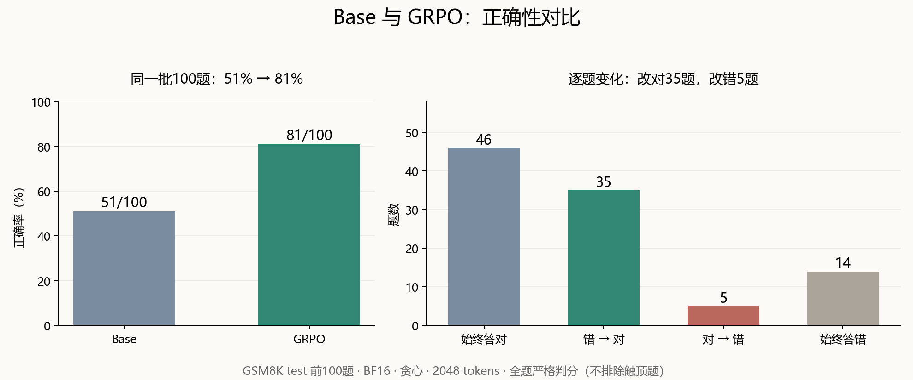
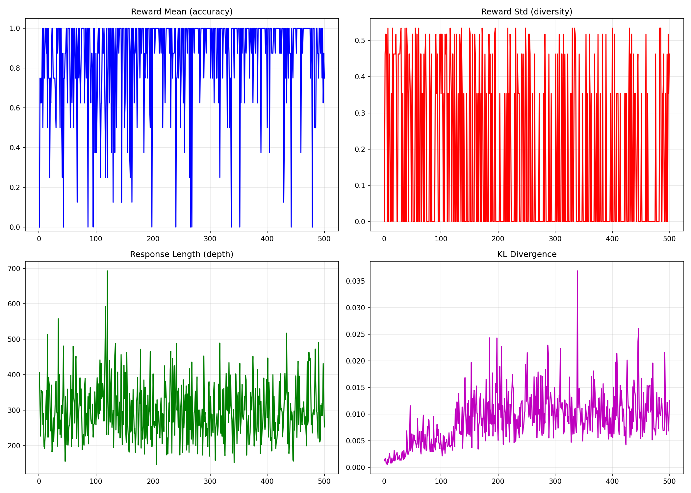

# 纯 GRPO 数学题实验：从 51/100 到 81/100

## 0. 核心原理：GRPO

PPO 类语言模型训练通常使用价值函数网络估计优势；GRPO 用同一题目采出的 G 个回复的组内奖励作为相对基线，省去单独训练的 Critic，但仍需为 G 次生成付出成本。

对题目 q 采样 G 个回复，按标准答案计算 0/1 奖励。实现中会对组内奖励做中心化和缩放，再用带裁剪的策略目标更新模型。组内全对或全错时，正确性奖励没有相对差异，基本不能提供有效更新。此 notebook 额外设 beta=0.001，引入参考模型 KL 约束。

完整数学公式推导与定义如下。

---

### 1. 组内相对优势计算（Group Relative Advantage）

对于给定的输入问题 $q \sim P(Q)$，从当前旧策略 $\pi_{\theta_{\text{old}}}$ 中独立采样 $G$ 个候选回答：

$$\{o_1, o_2, \dots, o_G\} \sim \pi_{\theta_{\text{old}}}(O \mid q)$$

每个回答 $o_i$ 经由标量奖励函数计算得到奖励 $r_i$（如可验证规则输出的 0 或 1）。

计算这 $G$ 个奖励的组内均值 $\bar{r}$ 和组内标准差 $\sigma_r$：

$$\bar{r} = \frac{1}{G} \sum_{j=1}^G r_j$$

$$\sigma_r = \sqrt{\frac{1}{G} \sum_{j=1}^G (r_j - \bar{r})^2}$$

第 $i$ 个回答的**组内相对优势（Group Relative Advantage）** $A_i$ 定义为：

$$A_i = \frac{r_i - \bar{r}}{\sigma_r + \epsilon_{\text{eps}}}$$

> **数值边界（全对/全错情况）：**
> 当采样出的 $G$ 个回答全对（所有 $r_i=1$）或全错（所有 $r_i=0$）时，$\sigma_r = 0$。加入极小常数 $\epsilon_{\text{eps}}$（通常取 $10^{-8}$ 或 $10^{-4}$）后，$A_i \approx 0$。这意味着在无相对差异的样本组中，梯度贡献趋近于零。

---

### 2. Token 粒度概率比率（Probability Ratio）

本质就是重要性采样，但是是token粒度，不是序列级。对于第 $i$ 个回答中的第 $t$ 个 Token $o_{i,t}$，当前策略与采样所用旧策略的概率比率为：

$$r_{i,t}(\theta) = \frac{\pi_\theta(o_{i,t} \mid q, o_{i,<t})}{\pi_{\theta_{\text{old}}}(o_{i,t} \mid q, o_{i,<t})}$$

完整序列 $o = (o_1, o_2, \dots, o_T)$ 的严谨重要性采样权重应该是所有 Token 概率比率的累乘：$$W_{\text{seq}}(\theta) = \frac{\pi_\theta(o \mid q)}{\pi_{\theta_{\text{old}}}(o \mid q)} = \prod_{t=1}^T \frac{\pi_\theta(o_t \mid q, o_{<t})}{\pi_{\theta_{\text{old}}}(o_t \mid q, o_{<t})} = \prod_{t=1}^T r_{i,t}(\theta)$$
在长文本生成（数百至数千 Token）中，如果使用累乘 $\prod_{t=1}^T r_{i,t}(\theta)$：只要策略发生微小漂移，连乘项就会发生严重的数值爆炸或消失（Variance Explosion），导致方差极大，训练崩溃。

---

### 3. GRPO 策略优化目标函数（Clipped Objective）

GRPO 最终优化的最大化目标函数 $\mathcal{J}_{\text{GRPO}}(\theta)$ 包含了带 PPO 裁剪机制的策略提升项，以及针对参考模型 $\pi_{\text{ref}}$ 的 KL 散度约束项：

$$\mathcal{J}_{\text{GRPO}}(\theta) = \mathbb{E}_{\substack{q \sim P(Q) \\ \{o_i\}_{i=1}^G \sim \pi_{\theta_{\text{old}}}}} \left[ \frac{1}{G} \sum_{i=1}^G \frac{1}{\vert{}o_i\vert{}} \sum_{t=1}^{\vert{}o_i\vert{}} \left( \min \left( r_{i,t}(\theta) A_i, \, \text{clip}\left(r_{i,t}(\theta), 1-\epsilon, 1+\epsilon\right) A_i \right) - \beta D_{\text{KL}}(\pi_\theta \parallel \pi_{\text{ref}}) \right) \right]$$

其中：

* **$\epsilon$**：PPO 裁剪范围超参数（通常设为 $0.1$ 或 $0.2$）。
* **$\beta$**：KL 惩罚系数（对应你代码设置中的 $\beta = 0.001$）。
* **$\vert{}o_i\vert{}$**：第 $i$ 个回答的序列长度（对长序列做平均归一化）。

---

### 4. KL 散度无偏/低方差估计器（KL Estimator）

为了在采样生成的序列上高效计算逐 Token 的 KL 散度，DeepSeek-R1 实操中常用 **Schulman 低方差无偏估计器**：

$$D_{\text{KL}}(\pi_\theta \parallel \pi_{\text{ref}}) = \frac{\pi_{\text{ref}}(o_{i,t} \mid q, o_{i,<t})}{\pi_\theta(o_{i,t} \mid q, o_{i,<t})} - \ln \frac{\pi_{\text{ref}}(o_{i,t} \mid q, o_{i,<t})}{\pi_\theta(o_{i,t} \mid q, o_{i,<t})} - 1$$

若令 $k = \frac{\pi_{\text{ref}}(o_{i,t} \mid q, o_{i,<t})}{\pi_\theta(o_{i,t} \mid q, o_{i,<t})}$，上式可简写为：

$$D_{\text{KL}}(\pi_\theta \parallel \pi_{\text{ref}}) = k - \ln k - 1$$

> 该估计器保证满足 $D_{\text{KL}} \ge 0$，且极小化单样本估计时的方差。

---

### 5. 梯度更新公式展开

当概率比率 $r_{i,t}(\theta)$ 处于未裁剪区间 $[1-\epsilon, 1+\epsilon]$ 内时，忽略 KL 项，单个 Token 的参数梯度简化为：

$$\nabla_\theta \mathcal{J}_{i,t}(\theta) = \nabla_\theta \ln \pi_\theta(o_{i,t} \mid q, o_{i,<t}) \cdot A_i$$

* **当 $A_i > 0$（表现优于组内平均水平）：** 增大生成该 Token 的对数概率。
* **当 $A_i < 0$（表现劣于组内平均水平）：** 降低生成该 Token 的对数概率。

本实验从已预训练的 Qwen3 Base 开始，不先进行本实验的 SFT，因此只是在小规模环境中学习 R1-Zero 式的可验证奖励训练流程，并非完整复现 DeepSeek-R1-Zero。

这次我做了一个小型“R1-Zero”实验：从已经预训练的 **Qwen3-1.7B-Base** 出发，不先做本实验的 SFT，只用 GSM8K 最终数值的正确性奖励训练。重点是亲手跑通训练、看组内奖励和测试结果。
## 1. 最终结果

训练完成500步，训练耗时 **2039.68秒，约34分钟**。最终在 GSM8K test 的前100题上重新评估四个模型：

| 模型 | 全题答对 / 100 | 全题准确率 | 触顶排除 | 未触顶答对 / 可计分 | 未触顶准确率 |
|---|---:|---:|---:|---:|---:|
| Base | 51 / 100 | 51% | 1 | 51 / 99 | 51.52% |
| GRPO | 81 / 100 | 81% | 0 | 81 / 100 | 81% |
| Distill | 60 / 100 | 60% | 0 | 60 / 100 | 60% |
| Instruct-Think | 56 / 100 | 56% | 44 | 56 / 56 | 100% |

图中使用全部100题作分母：GRPO 比 Base 多答对30题，其中35题由错变对、5题由对变错。

**Base→GRPO 净增30个百分点。** 同题逐项复算：35题从错变对，5题从对变错，其余60题正确性不变。分数不仅反映解题，也受到答案表达是否能被严格解析的影响：Base 明确可解析66题，GRPO 98题，因此不能把全部增益解释成新增数学知识。

Instruct-Think 的结果尤其容易误读：44题碰到2048-token上限，剩余56题全部答对。排除触顶题后的100%是条件准确率，不是原100题准确率。

## 2. 训练到底做了什么

流程很短：**GSM8K train → 构造纯文本解题提示 → 每题采8个回答 → 最终数值0/1奖励 → GRPO更新 → 独立test评估**。

| 设置 | 实际训练配置 |
|---|---|
| 起点 | Qwen/Qwen3-1.7B-Base |
| 更新方式 | BF16 全参数；未用LoRA/QLoRA |
| 数据 | openai/gsm8k，main，train；提示超过512 tokens的题过滤 |
| 生成 | G=8，temperature=1.0，top_p=0.95，最大1024 tokens |
| 优化 | 500 steps，学习率5e-6，beta=0.001，seed=42 |
| Batch | 单卡batch=1，梯度累积8，有效生成batch=8 |
| 损失 | TRL GRPOTrainer，loss_type=bnpo，组内奖励缩放开启 |
| 生成加速 | vLLM colocate，显存比例0.3 |
| 硬件 | 训练使用A800 80GB；最终评估卡型未独立核实 |
| 环境 | Python 3.12，PyTorch 2.11.0+cu129，Transformers 4.57.6，TRL 1.14.1，vLLM 0.20.0 |

虽然配置写了训练1轮，但 max_steps=500 会让训练在500次参数更新后停止，实际只跑了约6.69%的训练集。这次每次更新对应一道题的8个回答，因此总共采样了约500道题、生成4000个回答，并没有训练完整个数据集。看奖励表来说，应该还没拟合完。

500个训练步骤中，有304步的8个回答全部答对或全部答错。这些回答得分相同，无法通过组内比较获得正确性学习信号，但仍可能受到KL约束的更新。

训练奖励前100步平均0.7863，末100步0.8925；对应零方差比例从0.45升到0.67。更多题变成组内全对也可能提高这个比例，不能单凭它判定训练失败。

## 从20题到100题：先修评估，再解释分数

最初只测了20题，生成上限1024、使用宽松解析：Base 13/20、GRPO 15/20、Distill 14/20、Instruct-Think 8/20。随后扩到100题，预算改2048，解析规则也更严格。**这两轮同时改变题数、预算和解析器，不能用分数差推断训练继续进步。它们评估的是同一次训练权重。**

最终协议如下：

- 四模型用同一批test前100题，BF16，不量化，贪心生成，最大2048 tokens。
- Base和GRPO用同一纯文本提示；Distill和Instruct用各自chat模板，Instruct开启thinking。
- 若出现 `</think>`，只在闭合标签后的最终回答里找答案。取最后一个明确 `boxed`，否则找 `####`、答案短语或纯数字。
- 末尾数字回退仅保存用于审计，不用于正式判分。找不到明确答案记为不可解析，不从分母悄悄删掉。
- 达到上限的记录完整保存，另报未触顶准确率、排除数和全题准确率。单独记录EOS，区分触顶与真正截断。
- 前三个模型逐题推理；最后一个改batch=4（不然太慢了），逐批保存并支持续跑。批推理可能产生数值差异，这是比较的一个限制。

本次评估统一使用贪心解码，而 Qwen3 官方建议思考模式使用采样，避免重复生成。因此，这组结果只能说明各模型在本次评估设置下的表现，不能说明 GRPO 模型整体优于原版 Qwen3 思考模型。参见[官方模型卡](https://huggingface.co/Qwen/Qwen3-1.7B)。

## 3. 运行中踩过的坑

| 问题 | 实际处理与边界 |
|---|---|
| GPU计费时下载很慢 | 先无卡安装依赖，数据和缓存放持久存储盘； |
| flash-attn没装 | 自动回退SDPA，日志打印了回退；配置中请求flash不代表实际用了flash |
| 无卡检查通过、有卡导入失败 | vLLM二进制要求libcudart.so.13，环境只有CUDA12.9 runtime；额外安装CUDA13 runtime并预加载后，有卡导入验证通过 |
| 浏览器卡顿 | 训练输出包含大量生成样本；公开Notebook清空输出，训练日志和评估单独存文件 |
| Instruct评估很慢 | 思考输出长，逐题生成慢；最后一个改batch=4 |
| 断网与中断担心丢结果 | 每个模型保存JSON；最后一个每批保存partial记录，完成后合并summary |

保存采用 `save_only_model=True`，没有优化器和调度器状态。最终权重可以重新推理评估，但不是可精确续训的完整checkpoint。

## 4. 现在能说什么

这次纯GRPO在固定100题、给定提示和生成预算的协议下，确实提高了可解析正确答案数。结果值得继续验证，但它是**单次训练、测试集前100题**，不是完整GSM8K分数，也不支持与官方benchmark排名比较。

下一步优先做：完整test集评估；抽查不可解析与错题；对thinking参考模型另设采样协议和更充足预算；重复训练种子。先把评估证据补扎实，再考虑SFT→GRPO路线。

## 5. 代码与数据

项目代码、逐题输出、实际训练配置和日志见 [GitHub项目仓库](https://github.com/cppywh/mini-deepseek-r1-zero)。模型权重只备份本地，不推到GitHub。文章中的100题指标由保存的逐题JSON复算；20题结果来自Notebook输出转录，未独立复算。

